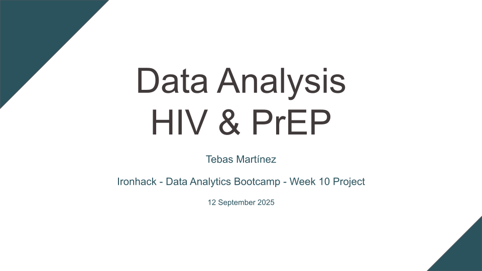

# Data Analysis: HIV and PrEP

# Questions
- Is an increase in PrEP users connected to a decrease in new HIV cases?
- Is an increase in ART coverage connected to a decrease in new HIV cases?
- Does PrEP use correlate with an increase or decrease of other STIs?

# Data Sources & Data Retrieval
- [The Global Health Observatory](https://www.who.int/data/gho/info/gho-odata-api), World Health Organization's API
- [AVAC, the global PrEP tracker](https://data.prepwatch.org/)
- [2024 Q4 Global PrEP Tracker](https://www.prepwatch.org/resources/global-prep-tracker/), PrEP Watch, AVAC
- [PrEP Country Data](https://www.prepwatch.org/data-by-country/), PrEP Watch, AVAC
- [*Pre-exposure prophylaxis for HIV prevention in Europe and Central Asia*](https://www.ecdc.europa.eu/en/publications-data/pre-exposure-prophylaxis-hiv-prevention-europe-and-central-asia-monitoring), European Centre for Disease Prevention and Control

The data about HIV cases, ART, and other STIs was extracted from World Health Organization's API, while the data about PrEP is taken from PrEP Watch's *2024 Global PrEP Tracker*. A list of countries who had implemented PrEP by 2023 was extracted from the report by the European Centre for Disease Prevention and Control to analyse other STIs.

# Methodology and Analysis
To answer the first two questions required filtering by countries where we have good quality PrEP data. Countries were manually chosen and filtered from PrEP Watch's data: Australia, Burundi, Brazil, Cameroon, Ethiopia, Kenya, Nigeria, Rwanda, Eswatini, Thailand, Uganda, South Africa, Zambia, Zimbabwe. Data from 2010 to 2024 was used.
- Is an increase in PrEP users connected to a decrease in new HIV cases?
  - While aggregated data of all filtered countries doesn't show a clear correlation, with a Spearman p-value of 0.1202156571109024. However, filtering out by country shows in a lot of cases a clear correlation between an in PrEP users and a decrease in new HIV cases. More data would be needed to further analyse this correlation.
- Is an increase in ART coverage connected to a decrease in new HIV cases?
  - We can see a correlation between ART coverage and a decrease in new HIV cases, with a Spearman p-value of 1.8671143724192612e-11.

Unfortunately, countries with good quality PrEP data didn't provide enough data about STIs through The Global Health Observatory. As a workaround, to get close to an answer to this question, I filtered european countries reported by the European Centre for Disease Prevention and Control as having implemented PrEP guidelines and national funding by the end of 2023, including: Portugal, Spain, France, Ireland, United Kingdom, Iceland, Norway, Finland, Estonia, Belgium, Netherlands, Germany, Switzerland, Italy, Slovenia, Croatia, North Macedonia, Slovakia, Ukraine.
- Does PrEP use correlate with an increase or decrease of other STIs?
  - While there is not enough data to cross PrEP use with other STIs, we can check correlations between years and cases of chlamydia and syphilis. Analysing data from 2010 to 2023, we see stable means through the years before PrEP existed and an increase in both STIs in the years when PrEP was already implemented for both STIs. Pearson p-values suggest a correlation between year and cases of chlamydia (p = 0.03139495034647706
) and syphilis (p = 0.006135757204563969). We have to be cautious when interpreting these correlations, since factors other than PrEP might have influenced this trend.

# Resources
- [Presentation](https://docs.google.com/presentation/d/1zKthNErTzIAfMiB7lGBkzrYkgW3oh-fI48qB_Uye-eE/edit?usp=sharing)
